# Text-to-SQL Training Pipeline Flow Diagram

## 🚀 Script Execution Flow & Logic

This document provides a comprehensive flow diagram of the `text_to_sql_train.py` script from start to finish.

---

## 📊 **MAIN EXECUTION FLOW**

```mermaid
flowchart TD
    A[🎯 Script Start] --> B[📝 Parse CLI Arguments]
    B --> C[⚙️ Initialize TextToSQLConfig]
    C --> D[🔧 Apply User Configurations]
    D --> E{🎮 Execution Mode?}
    
    E -->|train| F[🎓 TRAINING PHASE]
    E -->|deploy| G[🚀 DEPLOYMENT PHASE]
    E -->|test| H[🧪 TESTING PHASE]
    E -->|full| I[📋 ALL PHASES]
    
    I --> F
    F --> J[📊 Data Processing]
    J --> K[🤖 Model Training]
    K --> L[📈 Model Evaluation]
    L --> M{Mode = full?}
    M -->|Yes| G
    M -->|No| END[✅ Complete]
    
    G --> N[🔗 Ollama Deployment]
    N --> O{Mode = full?}
    O -->|Yes| H
    O -->|No| END
    
    H --> P[🧪 Model Testing]
    P --> END
    
    style A fill:#e1f5fe
    style END fill:#c8e6c9
    style F fill:#fff3e0
    style G fill:#f3e5f5
    style H fill:#e8f5e8
```



---

## 🔧 **CONFIGURATION & INITIALIZATION PHASE**

```mermaid
flowchart TD
    A[📝 Parse Arguments] --> B{Device Specified?}
    B -->|auto| C[🔍 Auto-detect Device]
    B -->|forced| D[🎯 Use Forced Device]
    
    C --> E{Device Type?}
    E -->|Mac MPS| F[🍎 Apply Mac Optimizations]
    E -->|NVIDIA GPU| G[🟢 Apply NVIDIA Optimizations]
    E -->|CPU| H[💻 Apply CPU Optimizations]
    
    D --> I{Forced Device Type?}
    I -->|mps| F
    I -->|cuda| G
    I -->|cpu| H
    
    F --> J[⚡ Small batch, fast settings]
    G --> K[🚄 Large batch, high performance]
    H --> L[🐌 Conservative settings]
    
    J --> M[📋 Configuration Complete]
    K --> M
    L --> M
    
    style A fill:#e3f2fd
    style M fill:#c8e6c9
    style F fill:#fff8e1
    style G fill:#e8f5e8
    style H fill:#fce4ec
```



---

## 📊 **DATA PROCESSING PHASE**

```mermaid
flowchart TD
    A[🏁 Start Data Processing] --> B[📥 Load Gretel AI Dataset]
    B --> C{Max Samples Set?}
    C -->|Yes| D[✂️ Limit Dataset Size]
    C -->|No| E[📋 Use Full Dataset]
    
    D --> F[🔄 Format Samples for Training]
    E --> F
    
    F --> G[📝 Create Instruction-Tuning Format]
    G --> H{Stratification Possible?}
    
    H -->|Yes| I[🎯 Stratified Train/Val Split]
    H -->|No| J[🎲 Random Train/Val Split]
    
    I --> K[💾 Save Processed Data]
    J --> K
    K --> L[✅ Data Processing Complete]
    
    style A fill:#e8f5e8
    style L fill:#c8e6c9
    style G fill:#fff3e0
```



### **Data Format Structure:**
```
Input Format:
- Instruction: "You are an expert SQL generator for [domain]..."
- Input: "Database Schema: [schema]\nRequest: [question]"
- Output: "```sql\n[query]\n```\nExplanation: [explanation]"
```

---

## 🤖 **MODEL TRAINING PHASE**

```mermaid
flowchart TD
    A[🏁 Start Model Training] --> B[🔍 Detect Device Capabilities]
    B --> C[📦 Load Base Model & Tokenizer]
    C --> D{Quantization Enabled?}
    
    D -->|Yes| E[⚡ Setup 4-bit Quantization]
    D -->|No| F[💽 Load Full Precision]
    
    E --> G{Load Successful?}
    F --> G
    G -->|No| H[🔄 Fallback Strategy]
    G -->|Yes| I[🎛️ Setup LoRA Configuration]
    
    H --> I
    I --> J[🔧 Configure Training Arguments]
    J --> K[🏃 Execute Training Loop]
    K --> L[💾 Save Model/Adapter]
    L --> M[✅ Training Complete]
    
    style A fill:#e8f5e8
    style M fill:#c8e6c9
    style K fill:#fff3e0
```



### **LoRA Configuration:**
- **Target Modules**: `["q_proj", "v_proj", "k_proj", "o_proj", "gate_proj", "up_proj", "down_proj"]`
- **Rank (r)**: `16` (adaptation matrix size)
- **Alpha**: `32` (scaling factor)
- **Dropout**: `0.1` (regularization)

---

## 🚀 **DEPLOYMENT PHASE**

```mermaid
flowchart TD
    A[🏁 Start Deployment] --> B[🗺️ Map HF Model to Ollama]
    B --> C{Base Model Available?}
    C -->|No| D[📥 Pull Base Model]
    C -->|Yes| E[📝 Create Modelfile]
    
    D --> F{Pull Successful?}
    F -->|No| G[🔄 Try Alternative Model]
    F -->|Yes| E
    G --> E
    
    E --> H[🏗️ Build Ollama Model]
    H --> I{Build Successful?}
    I -->|Yes| J[✅ Deployment Complete]
    I -->|No| K[❌ Deployment Failed]
    
    style A fill:#f3e5f5
    style J fill:#c8e6c9
    style K fill:#ffcdd2
```



### **Model Mapping Examples:**
- `codellama/CodeLlama-7b-Instruct-hf` → `codellama:7b`
- `defog/sqlcoder-7b` → `codellama:7b` (fallback)

---

## 🧪 **TESTING PHASE**

```mermaid
flowchart TD
    A[🏁 Start Testing] --> B[📋 Create Test Cases]
    B --> C[🔄 For Each Test Case]
    C --> D[📤 Send Query to Ollama]
    D --> E[📥 Receive SQL Response]
    E --> F[📊 Log Results]
    F --> G{More Tests?}
    G -->|Yes| C
    G -->|No| H[✅ Testing Complete]
    
    style A fill:#e8f5e8
    style H fill:#c8e6c9
    style D fill:#fff3e0
```



---

## 📱 **COMMAND-LINE INTERFACE FLOW**

```mermaid
flowchart TD
    A[⌨️ CLI Input] --> B{Mode?}
    
    B -->|--mode train| C[🎓 Training Only]
    B -->|--mode deploy| D[🚀 Deployment Only]
    B -->|--mode test| E[🧪 Testing Only]
    B -->|--mode full| F[📋 Complete Pipeline]
    
    G[⚙️ Options Applied]
    
    C --> G
    D --> G
    E --> G
    F --> G
    
    H[🔧 Device Options]
    I[📊 Data Options]
    J[🤖 Model Options]
    
    H --> G
    I --> G
    J --> G
    
    style A fill:#e3f2fd
    style G fill:#c8e6c9
```



### **CLI Options Categories:**

#### **🔧 Device & Performance:**
- `--device [auto|cpu|cuda|mps]` - Force specific device
- `--fast-mac` - Aggressive Mac optimizations
- `--cpu-mode` - CPU-only with optimizations
- `--no-quantization` - Disable 4-bit quantization

#### **📊 Data & Training:**
- `--max-samples N` - Limit training samples
- `--save-full-model` - Save complete model (not just LoRA)

#### **🤖 Model Configuration:**
- `--base-model MODEL` - Override default base model
- `--model-name NAME` - Custom Ollama model name

---

## 🛠️ **ERROR HANDLING & FALLBACK STRATEGIES**

```mermaid
flowchart TD
    A[❌ Error Detected] --> B{Error Type?}
    
    B -->|Model Loading| C[🔄 Quantization Fallback]
    B -->|Device| D[🔄 Device Fallback]
    B -->|Dataset| E[🔄 Data Fallback]
    B -->|Deployment| F[🔄 Ollama Fallback]
    
    C --> G[💽 Load without quantization]
    D --> H[💻 Fall back to CPU]
    E --> I[🎲 Simple random split]
    F --> J[📥 Try alternative base model]
    
    G --> K{Success?}
    H --> K
    I --> K
    J --> K
    
    K -->|Yes| L[✅ Continue Execution]
    K -->|No| M[❌ Fatal Error]
    
    style A fill:#ffcdd2
    style L fill:#c8e6c9
    style M fill:#f44336
```



---

## 📋 **MEMORY OPTIMIZATION STRATEGIES**

### **🎯 Device-Specific Optimizations:**

| Device | Batch Size | Quantization | Precision | Special Settings |
|--------|------------|--------------|-----------|------------------|
| **🍎 Mac MPS** | 2 | Disabled | fp32 | Gradient checkpointing off |
| **🟢 NVIDIA GPU** | 8 | 4-bit NF4 | bf16/fp16 | Flash attention |
| **💻 CPU** | 1 | Disabled | fp32 | Conservative settings |

### **🧠 Memory Management:**
- **Gradient Checkpointing**: Trade compute for memory
- **LoRA Adapters**: Only train small adapter layers
- **4-bit Quantization**: 75% memory reduction
- **Batch Accumulation**: Simulate larger batches

---

## 🎯 **EXECUTION EXAMPLES**

### **🚀 Quick Mac Development:**
```bash
python text_to_sql_train.py --fast-mac --max-samples 500
```

### **💪 Full GPU Training:**
```bash
python text_to_sql_train.py --mode full --device cuda
```

### **🖥️ CPU-Only Training:**
```bash
python text_to_sql_train.py --cpu-mode --max-samples 1000
```

### **📦 Deploy Only:**
```bash
python text_to_sql_train.py --mode deploy --model-name my-sql-model
```

---

## 📈 **Performance Monitoring**

The script includes comprehensive logging at every stage:

- **📊 Data Processing**: Sample counts, formatting success rate
- **🤖 Model Training**: Loss curves, device utilization, memory usage
- **🚀 Deployment**: Model creation status, Ollama integration
- **🧪 Testing**: Query success rate, response quality

All logs are saved to `text_to_sql_training.log` for debugging and analysis.

---

## 🎉 **Success Criteria**

1. **✅ Training**: Model loss decreases, adapters saved successfully
2. **✅ Deployment**: Ollama model created and accessible
3. **✅ Testing**: Model generates syntactically correct SQL
4. **✅ Integration**: End-to-end pipeline completes without errors

This flow ensures a robust, device-agnostic text-to-SQL model training and deployment pipeline!
